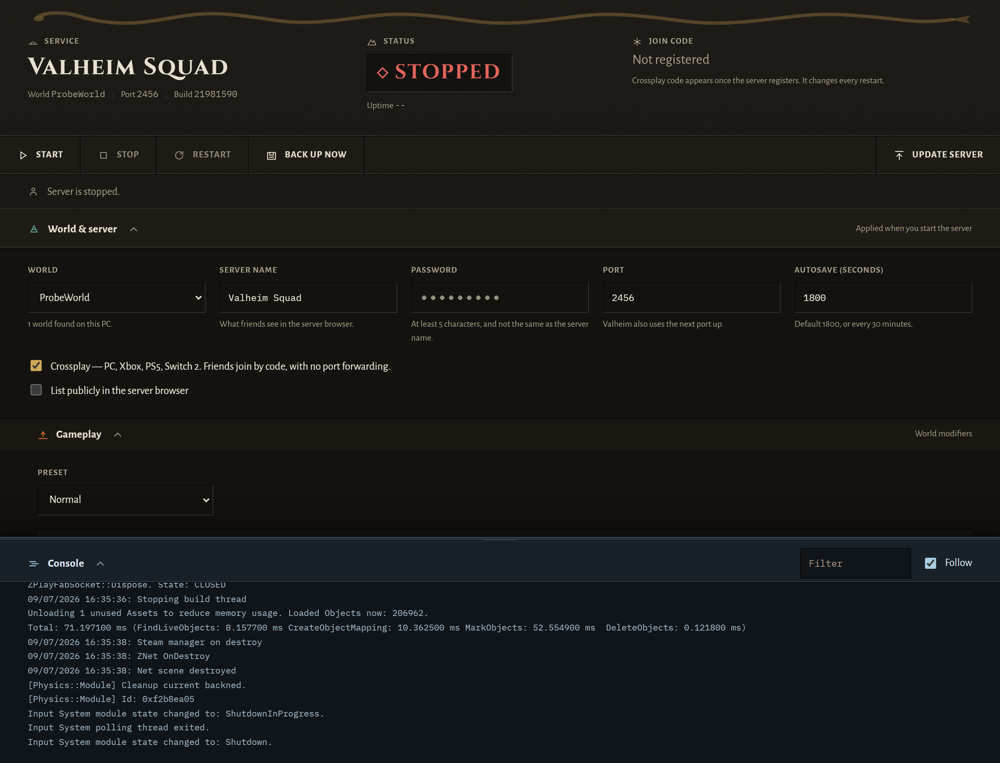

# Valheim Server Board

A LAN-only control panel for a Valheim dedicated server running on a home
Windows PC. Start, stop, monitor, back up, and update the server from a browser.



## Running it

Double-click **`start.bat`**. It installs dependencies on first run, starts the
panel, and opens <http://localhost:8080>.

From another device on the same network, use this PC's LAN address, for example
`http://192.168.1.20:8080`.

## First-time setup

1. Start the panel.
2. Open **Settings**, set the server name, world, and a password (at least 5
   characters, and not the same as the server name), then save.
3. Press **Update server**. This downloads SteamCMD and installs the dedicated
   server — several minutes and a few GB.
4. Press **Start**. First boot on a brand-new world takes about a minute while
   the world generates. That is normal.
5. The **join code** appears in the header once the crossplay session registers.
   Send it to your friends. It changes every restart.

The panel only ever shows a code belonging to the server running right now. Stop
the server, restart it, or kill it outside the panel, and the code clears
immediately - a stale code is worse than none, because it is one you would send
to friends in good faith. If the panel is restarted while a server is up, it
replays the log to recover the session in progress rather than showing nothing.

## How friends connect

**With crossplay on you do not need port forwarding.** Valheim registers the
server with the PlayFab relay and friends join with the join code, over the
internet, with nothing exposed on your router. The Connection line under the
header says whether that registration actually happened.

Everything on that line is read from the server's own log. Nothing is probed,
and your address is never sent to a third party to test reachability - that
would require an external service, and the panel does not do it silently.

If you turn crossplay **off**, friends connect by IP instead, and that does need
UDP 2456-2457 forwarded to this PC. The panel then shows the public address
Valheim reported for itself.

## Security

**This panel has no authentication and is meant for your LAN only.** Anyone who
can reach port 8080 can stop your server and overwrite your world. Do not
forward this port, and do not run it on a public network. Your server password
is stored in plain text in `config.json` for the same reason.

`npm audit` reports moderate advisories in `qs`, reachable transitively through
Express 4. Both are request-parsing denial-of-service issues, exploitable only
by someone who can already send HTTP to the panel — which, under the LAN-only
threat model above, is someone already inside your network. Fixing them requires
migrating to Express 5. Worth doing eventually; not worth doing the week of a
launch.

## What the panel shows when

The page changes with the server. **Connected** and **Players & access** only
exist while a server is running - when nothing is up there is nothing to show,
so they are absent rather than empty.

**Gameplay** is nested inside **World & server**, since both configure a world
before it starts.

Settings stay reachable while the server runs, because staging a change for the
next restart is a normal thing to do. The band says "Takes effect on the next
restart", and the section folds itself when the server starts. Open it again and
it stays open.

## Gameplay settings

The **Gameplay** section exposes every world modifier Valheim supports:

| Modifier | Values | Controls |
|---|---|---|
| Combat | veryeasy, easy, normal, hard, veryhard | enemy health, damage, spawn rates |
| Death penalty | casual, veryeasy, easy, normal, hard, hardcore | skill progress lost on death |
| Resources | muchless, less, normal, more, muchmore, most | yield from trees, rocks, ore |
| Raids | none, muchless, less, normal, more, muchmore | how often events attack your base |
| Portals | casual, normal, hard, veryhard | what portals will carry |

Plus four toggles - no build cost, player events, passive creatures, no map -
and seven presets: Normal, Casual, Easy, Hard, Hardcore, Immersive, Hammer.

A preset sets the baseline and the game resolves it; anything you set
individually overrides it. A modifier left on **Normal** is not passed at all,
because omission is how Valheim expresses default. Values are validated before
a start, since an invalid modifier makes the server fail to launch silently.

## Players & access

The **Players & access** section builds a roster from the log: connection lines
carry the platform ID, character lines carry the name. Click a player for when
they were first and last seen, how many sessions, and buttons that write
Valheim three list files:

| List | Effect |
|---|---|
| Admin | Grants the in-game console (F5): kick, ban, spawn, no-clip |
| Banned | Blocked from the server |
| Allowed | While anyone is on this list, **everyone not on it is blocked** |

Writes preserve the file comment headers, including any you add yourself.
Turning on the allowed list asks for confirmation, because a non-empty
permittedlist silently locks out everyone else.

**Names are inferred.** The ID and the name arrive on two unrelated log lines
and are matched by order, which is right in the ordinary case and can mis-pair
if two people join in the same instant. The panel labels them rather than
presenting the pairing as fact.

**Inventory, skills and position cannot be edited, by this panel or any other.**
Valheim stores character data on each player own PC (`characters_local/*.fch`),
not on the server, which is why your character follows you between servers. Only
BepInEx mods that relocate characters server-side change this, and they require
every player to install them.

### Tested against a real client on 2026-09-07

**Banning someone already connected drops them within about six seconds.** No
restart needed. Measured: the id was written at 16:51:58 and the player was gone
at 16:52:04.

Worth knowing for anyone reading the log: a ban-induced disconnect prints **no
player-count line at all**, unlike an ordinary quit which logs
`Player connection lost ... now 0 player(s)`. The only trace is the server
reaping the player world objects, which is what the panel watches.

**Admin commands need `-console` on the *client*, not just a place on the admin
list.** Being on `adminlist.txt` is necessary but not sufficient: without
`-console` in the client Steam launch options, F5 does nothing and it looks
exactly like the admin grant failed. Add `-console` under
Steam - Valheim - Properties - Launch Options.

Whether `adminlist.txt` is re-read live or only at startup is still untested -
the client console was the confounding variable. Granting admin and then
restarting always works.

## Diagnostics

While the server runs, the header shows **CPU**, **memory** and **thread count**,
sampled every four seconds from the operating system, plus **world objects**
once the server has reported them.

Measured with a real player connected: **0.3-1% CPU and 1.09 GB**, effectively
indistinguishable from idle. The ten-player ceiling is nowhere near what this
costs.

World objects come from a line the server prints only occasionally - about ten
minutes after start in the one session where it was captured, and the interval
is not confirmed. It appears once the server has printed it and then stays,
rather than blinking in and out between readings.

CPU is a rate, not a total: Windows reports cumulative CPU seconds, so the panel
takes two readings and divides by the elapsed time, normalised across all cores.
The first tick reads "measuring" because a rate needs two samples. Uptime also
comes from the real process start time, which is why a server the panel adopted
still reports its true uptime.

There is no per-player ping. Valheim does not log latency and there is no RCON
to ask for it.

## Choosing a world

The **World** dropdown lists every world already on this PC and offers
"Create a new world". This exists because the field used to be free text, and a
typo there silently generated a brand-new empty world - the old one still on
disk, but you spawning somewhere unfamiliar.

Switching worlds asks for confirmation. Nothing is deleted; the previous world
stays on disk and you can switch back.

**Settings are remembered per world.** A world is a whole setup, not just a save
file - the friends who play on it know it by a particular server name and
password. Saving records the current settings against the current world, and
selecting a world brings its own settings back, so you never hand out a password
that belongs to a different world. A world you have not created yet inherits
whatever is on screen.

## Backups

Backups live in `data/backups/`, each a timestamped folder holding a complete
copy of the world's files plus a `backup.json` describing it.

They are taken automatically every 30 minutes while the server runs, before
every stop and restart, and whenever you press **Back up now**. The oldest are
pruned past `backupRetention` in `config.json`.

Backups are **format-agnostic on purpose.** Rather than copying `.db` and `.fwl`
by name, the panel copies every entry matching the world name, file or folder.
Valheim 1.0 may replace the file pair with a folder of pieces; a backup module
hardcoded to two extensions would have quietly started saving nothing on patch
day. Every backup is verified non-empty and fails loudly if it captured nothing.

**Restore** requires the server to be stopped, and snapshots the current world
before overwriting it — so a misclicked restore is itself recoverable.

## Update day (Valheim 1.0, 9 September 2026)

Valheim enforces a strict version lock: the server and every player must run the
identical build. Clients auto-update on launch day, so an un-updated server is
not slow — it is unreachable by everyone.

**Update first, before anything else.** Press **Update server** while the server
is stopped. The panel backs up, updates, and you start it again. The installed
build id is shown in the header next to the world name.

### If the log stops making sense after the patch

Player names or the join code disappearing from the header means Iron Gate
changed a log line. This does not require a code change:

1. Open `config.json` and find `logPatterns`.
2. Open `data/logs/server.log` and find the line that changed.
3. Edit the regex to match. Named capture groups carry the values —
   `(?<name>…)`, `(?<code>…)`, `(?<players>…)`.
4. Restart the panel.

The patterns for world saves and the join code are verified against a real
server. The connection and player-name patterns are **not** — no second machine
has ever joined this server — so they are the most likely to need adjusting.

## Configuration

`config.json` is created from `config.example.json` on first run.

| Key | Meaning |
|---|---|
| `panelPort` | Port the panel listens on (default 8080) |
| `serverExe` | Full path to `valheim_server.exe` |
| `installDir` | Where SteamCMD installs the server |
| `saveDir` | Valheim's **base** save directory; worlds live in `worlds_local` inside it |
| `server.*` | Launch settings — name, world, password, port, public, crossplay, save interval, backup cadence, preset, modifiers |
| `backupIntervalMinutes` | How often to snapshot while running |
| `backupRetention` | How many backups to keep |
| `logPatterns` | Regexes mapping log lines to events |

## How it works

The panel spawns `valheim_server.exe` **detached**, with `-logFile`, and records
the PID. Detached means the game server survives a panel restart — you can
restart or crash the panel without disconnecting anyone. The trade-off is that
the panel cannot read the server's stdout directly, so it tails the log file
instead.

Shutdown uses a graceful `taskkill`, which was verified against a real server to
reliably trigger a world save. `taskkill /F` is used only after a 60-second
timeout, and loses unsaved progress. See `docs/shutdown-probe.md` for the
measurements.

Status checks verify both that the recorded PID is alive **and** that it is
actually `valheim_server.exe`, because Windows recycles PIDs.

If a server is running that the panel did not start - left behind by a previous
panel session - the panel **adopts** it rather than reporting "stopped". Before
this existed, an orphan was invisible: status showed stopped while players were
connected, and Start would launch a second server that died instantly on the
already-bound port while reporting success. An adopted server shows its uptime
as "unknown", because the panel genuinely does not know when it started.

## Development

```bash
npm install
npm test        # 191 tests, node:test
npm start
```

| Module | Responsibility |
|---|---|
| `src/server.js` | Express app, REST routes, SSE |
| `src/process.js` | Spawn, stop, status, re-attach |
| `src/parser.js` | Log lines to events |
| `src/logtail.js` | Follows the log file |
| `src/backups.js` | Snapshot, restore, prune |
| `src/steamcmd.js` | Install and update |
| `src/settings.js` | Config validation, launch arguments |
| `src/gameplay.js` | World modifier definitions and validation |
| `src/worlds.js` | Discovers worlds on disk |
| `src/access.js` | Admin, banned and allowed lists |
| `src/roster.js` | Who has played, assembled from the log |
| `src/diagnostics.js` | CPU, memory and true uptime |
| `src/profiles.js` | Per-world settings profiles |
| `src/hub.js` | SSE fan-out |

Design documents: `PRODUCT.md` (product truth), `DESIGN.md` (the visual world),
`docs/superpowers/specs/` (the design spec), `docs/superpowers/plans/` (the
implementation plan).
